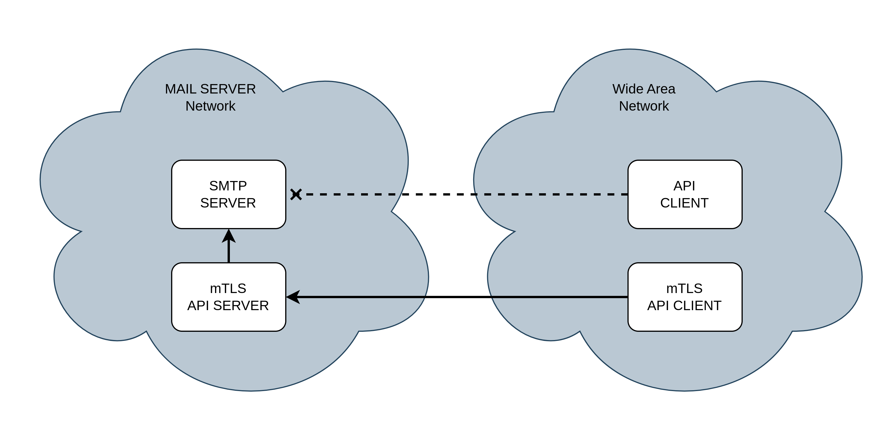

# SMTP 보안 강화를 위한 API 게이트웨이

이 프로젝트는 외부 서비스의 직접적인 SMTP 서버 접근을 차단하고, 안전한 메일 전송을 위한 API 게이트웨이를 제공합니다. 내부망에 위치한 SMTP 서버와의 통신은 API 서비스를 통해 중개되며, mTLS(Mutual Transport Layer Security)를 사용하여 강력한 보안을 유지합니다.

## 주요 기능

* **SMTP 서버 보호:** 외부 서비스의 직접적인 SMTP 서버 접근을 차단하여 보안을 강화합니다.
* **API 기반 메일 전송:** API 호출을 통해 메일을 전송하여 유연하고 안전한 메일 서비스를 제공합니다.
* **mTLS 인증:** 클라이언트와 서버 간의 상호 인증을 통해 안전한 통신 채널을 구축합니다.
* **내부망 격리:** SMTP 서버는 내부망에 격리되어 외부 위협으로부터 보호됩니다.
* **접근 제어:** 인증된 클라이언트만 API를 통해 메일을 전송할 수 있도록 접근을 제어합니다.

## mTLS 인증 방식

mTLS는 클라이언트와 서버가 서로의 인증서를 검증하여 안전한 통신을 보장하는 방식입니다.

1.  **인증서 발급:** 클라이언트와 서버는 동일한 CA(Certificate Authority)로부터 서명된 인증서를 발급받습니다.
2.  **핸드셰이크:** 클라이언트와 서버는 TCP 연결 시 서로의 인증서를 교환하고 검증합니다.
3.  **상호 인증:** 인증서 검증이 성공하면 안전한 통신 채널이 구축되고, 데이터가 암호화되어 전송됩니다.

## 사용 방법

1.  **인증서 발급:** CA로부터 클라이언트 및 서버 인증서를 발급받습니다.
2.  **API 서버 설정:** API 서버에 서버 인증서를 설정하고, mTLS를 활성화합니다.
3.  **클라이언트 설정:** 클라이언트 애플리케이션에 클라이언트 인증서를 설정하고, API 서버의 주소를 지정합니다.
4.  **API 호출:** 클라이언트는 API를 호출하여 메일을 전송합니다.

## 인증서 발급 방법
### 0. certs 디렉터리 생성
인증서 파일이 저장될 디렉터리를 생성하고, 해당 디렉터리로 이동합니다.
```sh
# certs 디렉터리 생성
mkdir certs

# certs 디렉터리 이동
mv certs
```

---

### 1. CA(인증기관) 인증서 생성

먼저, 자체 CA를 생성하여 서버와 클라이언트 인증서를 서명할 수 있습니다.

```sh
# CA 개인키 생성
openssl genrsa -out ca.key 2048

# CA 인증서 생성 (유효기간 100년, 36500일)
openssl req -x509 -new -nodes -key ca.key -days 36500 -out ca.crt -subj "/CN=MyCustomCA"
```

---

### 2. 서버 인증서 생성 (SAN 포함)

1. **서버 확장 설정 파일 생성**  
   예를 들어, `server.ext` 파일을 아래와 같이 작성합니다. SAN 항목에 요청받는 서버의 도메인을 입력합니다. 아래 예시에서는 `localhost`와 추가 도메인(`server.example.com`)으로 설정하였습니다.

    ```shell
   # server.ext 파일 생성 
   vi server.ext
    ```
   ```ini
   authorityKeyIdentifier=keyid,issuer
   basicConstraints=CA:FALSE
   keyUsage = digitalSignature, keyEncipherment
   extendedKeyUsage = serverAuth
   subjectAltName = @alt_names

   [alt_names]
   DNS.1 = localhost
   DNS.2 = server.example.com
   ```

2. **서버 개인키와 CSR 생성**

   ```sh
   # 서버 개인키 생성
   openssl genrsa -out server.key 2048

   # 서버 CSR 생성 (CN은 주로 참고용으로 사용)
   openssl req -new -key server.key -out server.csr -subj "/CN=server"
   ```

3. **서버 인증서를 CA로 서명할 때 SAN 확장 파일을 지정**

   ```sh
   openssl x509 -req -in server.csr -CA ca.crt -CAkey ca.key -CAcreateserial \
   -out server.crt -days 36500 -sha256 -extfile server.ext
   ```

---

### 3. 클라이언트 인증서 생성 (SAN 포함)

클라이언트 인증서에도 SAN 항목을 포함합니다. 클라이언트 전용 확장 설정 파일 `client.ext`를 아래와 같이 생성합니다.

1. **클라이언트 확장 설정 파일 생성**

    ```shell
   # client.ext 파일 생성 
   vi client.ext
    ```
   ```ini
   authorityKeyIdentifier=keyid,issuer
   basicConstraints=CA:FALSE
   keyUsage = digitalSignature, keyEncipherment
   extendedKeyUsage = clientAuth
   subjectAltName = @alt_names

   [alt_names]
   DNS.1 = localhost
   DNS.2 = unique_client.example.com
   ```

2. **클라이언트 개인키와 CSR 생성**

   ```sh
   # 클라이언트 개인키 생성
   openssl genrsa -out client.key 2048

   # 클라이언트 CSR 생성 (CN은 고유 식별자)
   openssl req -new -key client.key -out client.csr -subj "/CN=unique_client"
   ```

3. **클라이언트 인증서를 CA로 서명할 때 SAN 확장 파일을 지정**

   ```sh
   openssl x509 -req -in client.csr -CA ca.crt -CAkey ca.key -CAcreateserial \
   -out client.crt -days 36500 -sha256 -extfile client.ext
   ```

---

### 4. 요약

- **CA 인증서(ca.crt)와 개인키(ca.key)를 생성**하여 자체 서명한 CA를 구성합니다.
- **서버 인증서(server.crt)와 개인키(server.key)를 생성**하고, CA로 서명하여 서버의 신뢰성을 보장합니다.
- **클라이언트 인증서(client.crt)와 개인키(client.key)를 생성**하고, 동일한 CA로 서명하여 특정 클라이언트만 신뢰할 수 있게 합니다.

---

## 구성
